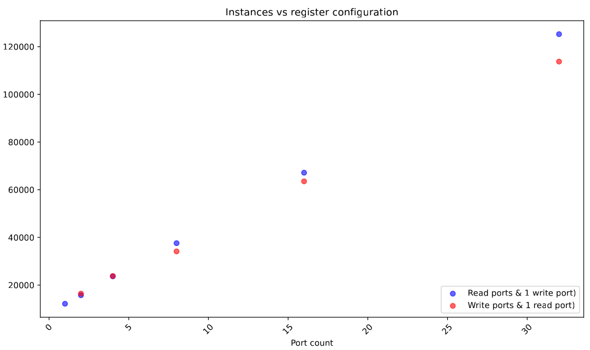
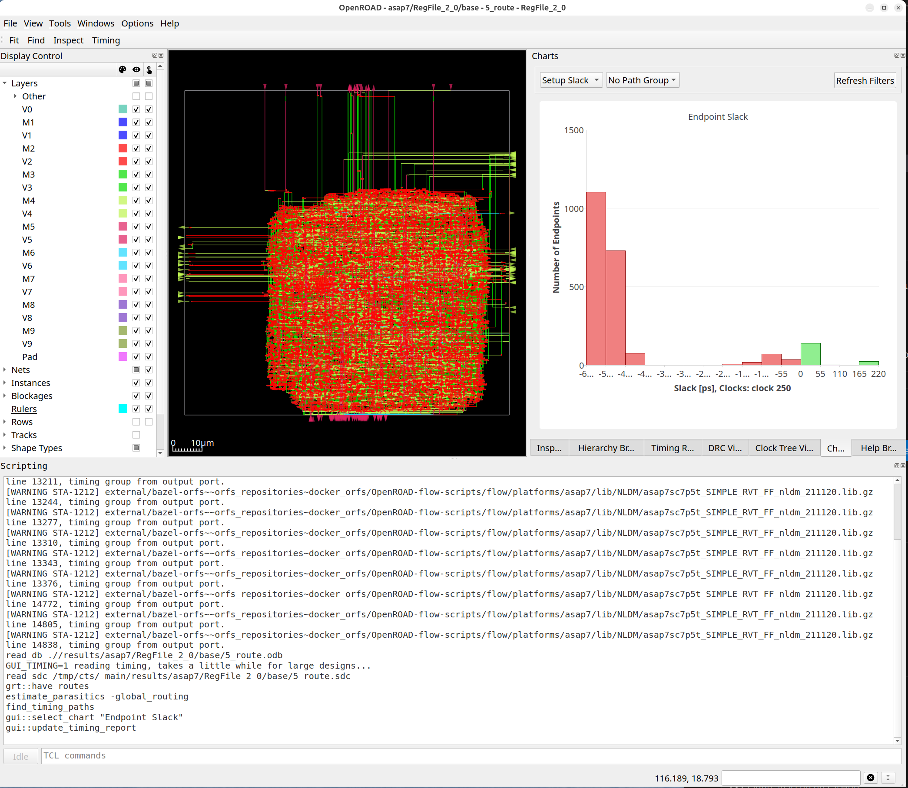

# A minimal architectural study using OpenROAD, OpenROAD-flow-scripts, Chisel and bazel-orfs

A minimalistic example of an architectural study of a register file using the tools above and setting it up using a Bazel BUILD file.

This illustrates the power of Bazel to create easy to use, once you have mastered it, what would be a complex setup using ad-hoc bash scripts, Docker, apt install, python pip install, etc.

## 📊 Register File Study Flow

```mermaid
graph TD
  Bazel["🛠️ Bazel<br/>From a dictinary in BUILD, creates a .json file with study details"]
  RegFile["📘 RegFile.scala<br/>Generates register file variants based on the .json generated above"]
  Verilog["📄 Verilog Modules<br/>Produced by Chisel"]
  OpenROAD["🏗️ OpenROAD<br/>Runs CTS + results.tcl to generate results.yaml for each register file"]
  Plot["📈 plot_results.py<br/>Plots results from YAML files"]

  Bazel --> RegFile --> Verilog --> OpenROAD --> Plot
```

## Register port cost study

In this simple architectural example study, the number of instances for a read port vs. a write port for a register file is studied. This is to help build an intuitive understanding if, given a choice, it is better to add read ports or write ports.

To run the study:

    $ bazelisk build plot
    [deleted]
    Target //:plot up-to-date:
      bazel-bin/plot.pdf
    [deleted]

View result:

    xdg-open bazel-bin/plot.pdf

## Conclusions

What is plotted below is the number of instances of a register file realized with flip-flops. The register file is 32 bits wide and 64 rows. The number of ports is 1 read port and varying number of write ports and vice versa.

Observations:

- The number of instances is completely dominated by ports, which is to be expected for a register file. A register file is all about access, whereas an SRAM is all about efficient storage of a large number of bits. The technology to store the bits is unimportant, all that matters is that access ports are realized efficiently. Hence, register files with a large number of ports can be realized with flip flops without affecting PPA materially, the focus has to be on the access network.
- The cost of read and write ports for a large number of ports is not materially different.

# The flow of the study

The parameters to be studied are articulated in the STUDY variable in the Bazel BUILD file. The parameters must be articulated in the BUILD file so that Bazel can set up all the build targets to be studied. The `STUDY` parameters is written to a .json file for consumption of the various Bazel rules.

A top level Chisel module instantiates all the register file variations and the Verilog is generated.

OpenROAD build targets with `orfs_flow` are set up to build each of the register file variations and results are collected using `orfs_run` to run `results.tcl` under OpenROAD to extract parameters and write it into a .yaml file.

Finally `plot_results.py` reads in all the .yaml files written out by `results.tcl` and plots the result above.

## Viewing a register file in OpenROAD

BUILD orfs_flow() is set up to run the flow through CTS, list all route targets:

    $ bazelisk query 'filter("_route$", //...)'
    [deleted]
    //:RegFile_2_0_route
    [deleted]

To view the in OpenROAD GUI, run:

    rm -rf /tmp/route
    bazelisk run //:RegFile_5_0_route /tmp/route gui_route

## Dependencies

To set up this study, Bazel downloads and sets up all the required components:

- [Chisel](https://www.chisel-lang.org/)
- [OpenROAD](https://github.com/The-OpenROAD-Project/OpenROAD)
- [OpenROAD-flow-scripts](https://github.com/The-OpenROAD-Project/OpenROAD-flow-scripts)
- [bazel-orfs](https://github.com/The-OpenROAD-Project/bazel-orfs)
- [Verilator](https://www.veripool.org/verilator/) (not actually used here, but in a study that includes reading .vcd into OpenSTA it would be used)
